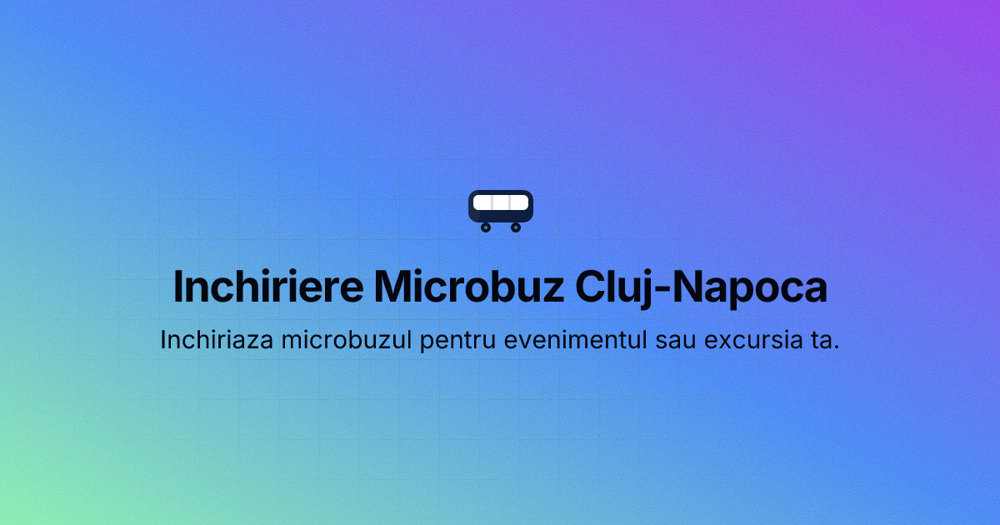

# Microbuz Cluj — Website

Site static pentru **închiriere microbuz 8+1 locuri în Cluj-Napoca**.  
Hosted pe GitHub Pages la [inchirieremicrobuzcluj.ro](https://inchirieremicrobuzcluj.ro).

## Structura fișierelor

```
├── index.html          # Pagina completă (toate secțiunile)
├── styles.css          # Tot CSS-ul (design tokens, layout, responsive)
├── script.js           # Actualizează automat anul din copyright
├── favicon.ico         # Favicon multi-rezoluție (16/32/48/64px)
├── .nojekyll           # Dezactivează Jekyll pe GitHub Pages (nu șterge!)
└── assets/
    └── images/
        └── bus.jpg     # ← Adaugă poza microbuzului aici (vezi mai jos)
```

## Rulare locală

```bash
python3 -m http.server 8080
```

Deschide [http://localhost:8080](http://localhost:8080).  
> Nu deschide `index.html` direct cu dublu-click — browserul blochează CSS/JS pe `file://`.

## Adăugare poză microbuz

1. Salvează poza ca `assets/images/bus.jpg`
2. În `index.html`, găsește blocul comentat din secțiunea vehiculului:
   ```html
   <!-- Placeholder — replace with real photo when available:
        
   -->
   <div class="vehicle-img" ...>🚌</div>
   ```
3. Șterge `<div class="vehicle-img">` și decomentează tag-ul ``
4. Actualizează și `og:image` din `<head>` dacă ai o altă cale:
   ```html
   <meta property="og:image" content="https://inchirieremicrobuzcluj.ro/assets/images/bus.jpg">
   ```

## Deploy pe GitHub Pages

1. Creează un repo pe GitHub (ex: `microbuz-cluj`)
2. Push cod:
   ```bash
   git remote add origin https://github.com/<username>/microbuz-cluj.git
   git push -u origin main
   ```
3. În repo → **Settings → Pages → Source: Deploy from branch → main / root → Save**
4. Adaugă domeniu custom: `inchirieremicrobuzcluj.ro`
5. GitHub creează automat fișierul `CNAME` — trage-l local:
   ```bash
   git pull origin main
   ```
6. La registrarul domeniului, adaugă DNS A records:
   ```
   185.199.108.153
   185.199.109.153
   185.199.110.153
   185.199.111.153
   ```

## Actualizare conținut

| Ce vrei să schimbi | Unde |
|---|---|
| Număr de telefon | `index.html` — caută `0746 063 301` (4 apariții) + `+40746063301` în link-uri |
| Prețuri | `index.html` — secțiunea `id="tarife"` |
| Texte servicii | `index.html` — secțiunea `id="servicii"` |
| Culori | `styles.css` — blocul `:root` la început |
| Copyright an | Automat via `script.js` |

## Date firmă

**SCHVARCZ ELECTRIC SOLUTIONS SRL** · CUI: RO39748741 · Cluj-Napoca
